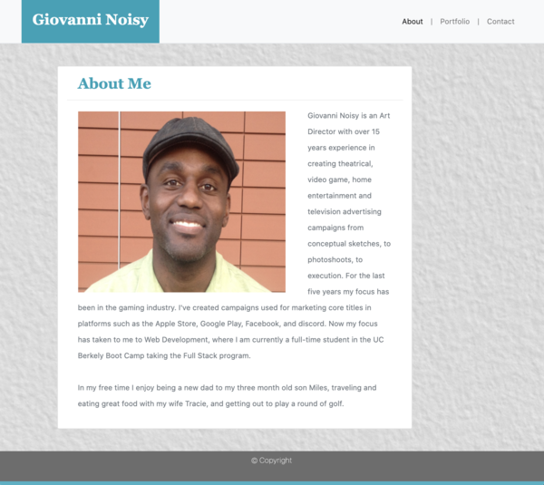

# Responsive Portfolio



This project required using the front-end framework Bootstrap, to build a mobile responsive portfolio. 

## Deployed Link

* [See Live Site](https://gnoisy.github.io/02-responsive-portfolio/)

## Prerequisites

You'll need an IDE such as VS Code or Atom. Copy and paste code into your IDE and you can save file to your local drive.

```
https://code.visualstudio.com/download

https://flight-manual.atom.io/getting-started/sections/installing-atom/
```

## Built With

* [BOOTSTRAP](https://getbootstrap.com/)
* [HTML](https://developer.mozilla.org/en-US/docs/Web/HTML)
* [CSS](https://developer.mozilla.org/en-US/docs/Web/CSS)

## Authors

* **Giovanni Noisy**

- [Link to Github](https://github.com/GNoisy)
- [Link to LinkedIn](https://www.linkedin.com/in/giovanni-noisy-04098989/)

### Acknowledgments

* MDN 
* w3schools
